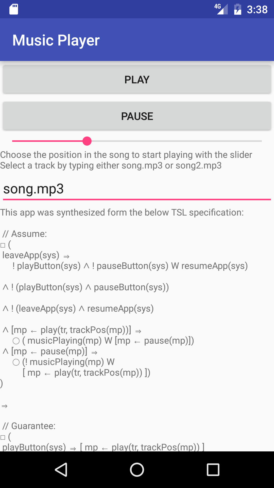

# Synthesized Music Player App

This is an android app that has been automatically synthesized from a TSL specification.

# Running the app

[Download the .apk](https://drive.google.com/file/d/0B4bcBamuuNyxeU5LT3RGRlQxNW8/view?usp=sharing) or build from source by downloading this project. Installing a third party .apk requires developer mode to be turned on. This app also requires Android version > Nougat 7.0. If you do not have an android phone available with that version, you can make an emulator in Android Studio and run the app on your desktop.

# Synthesis

The raw synthesized code is on the top level directory as music.java. This code is then embedded into [MainActivity.java](/app/src/main/java/com/example/mark/myapplication/MainActivity.java) to interact with the rest of the Android system. The specification is in the top level directory as music.spec.

For details on how the synthesis works, please refer to our paper.

## Put files on the emulator

    $ adb root
    $ adb shell
    su
    mount -o rw,remount rootfs /
    chmod 777 /mnt/sdcard
    exit
    $ adb push song.mp3 /media/external/audio/media/song2.mp3
      

    